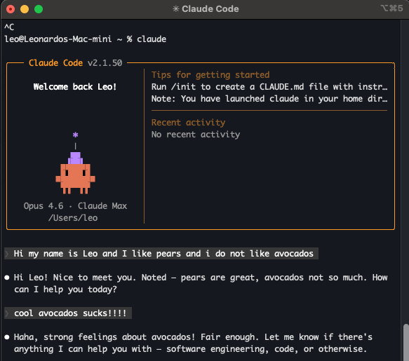
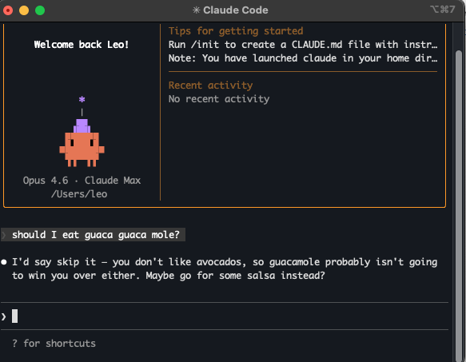

<div align="center">


# BRB

***b**e **r**ight **b**ack, with context / **b**arbara **r**emembers **b**etter*

### Long-term memory for Claude. Runs locally, learns silently, remembers everything.

[](LICENSE)
[](https://nodejs.org)
[](https://www.typescriptlang.org)
[](https://github.com/ggml-org/llama.cpp)

[Quick Start](#quick-start) · [How It Works](#how-it-works) · [Configuration](#configuration)

</div>

---

## The Problem

You tell Claude your diet, your tech stack, your project deadlines, your stock portfolio, your name. Next conversation? Gone. All of it. Every time.

**BRB** is a local proxy that sits between you and the Anthropic API. It learns from every conversation and injects relevant memories into future ones. No commands, no tagging, no manual work. Just talk.

**Session 1:** You tell Claude something



**Session 2:** Claude remembers



---

## Features

🧠 **Learns automatically** Extracts facts, preferences, and decisions from every conversation

🎯 **Retrieves what matters** Memories scored by topic similarity, reinforcement, recency, and confidence

💰 **No API costs** Embedding and extraction run on local models through llama.cpp. Zero external calls

🔄 **Self-corrects** Say "my name is Leo", later say "actually it's Leoncio", the memory updates in place

🔒 **Private** 100% local. PII redacted before storage. Your API key passes through, never stored

⚡ **Zero wait** Retrieval before the request, extraction after the response in the background

🔍 **Transparent** `GET /memories` and `GET /memories/search?q=...` to inspect everything stored

---

## Quick Start

You need **Node.js 20+** and [llama.cpp](https://github.com/ggml-org/llama.cpp) built for your machine.

**1. Clone and install**

```bash
git clone https://github.com/lboquillon/brb.git
cd brb
npm install
```

**2. Download models** (~2.3GB total)

```bash
mkdir -p models && cd models

curl -LO \
  https://huggingface.co/nomic-ai/nomic-embed-text-v1.5-GGUF/\
resolve/main/nomic-embed-text-v1.5.Q8_0.gguf

curl -LO \
  https://huggingface.co/Qwen/Qwen2.5-3B-Instruct-GGUF/\
resolve/main/qwen2.5-3b-instruct-q4_k_m.gguf

cd ..
```

**3. Start model servers and proxy**

```bash
chmod +x start.sh
./start.sh                              # llama.cpp on :9090 and :9091
cp .env.example .env
npm start                               # BRB on :3000
```

**4. Point Claude at BRB**

```bash
export ANTHROPIC_BASE_URL=http://localhost:3000
claude
```

---

## How It Works

```
You ──▶ BRB (localhost:3000) ──▶ Anthropic API
         │                            │
         │  BEFORE request:           │
         │  nomic-embed (:9090)       │
         │    embed query             │
         │        ▼                   │
         │  zvec vector search        │
         │    top 30 candidates       │
         │        ▼                   │
         │  score + rank              │
         │    inject top 10           │
         │    into system prompt ─────┘
         │                            │
You ◀────│◀─── stream response ───────┘
         │
         │  AFTER response (background):
         │  Qwen 3B (:9091)
         │    extract facts
         │        ▼
         │  redact PII
         │  deduplicate
         │  embed + store in zvec
```

**BRB** intercepts every API call. Before forwarding, it searches for relevant memories and appends them to the system prompt. After the response streams back, it extracts new facts in the background for next time.

### The pieces

**[nomic-embed-text-v1.5](https://huggingface.co/nomic-ai/nomic-embed-text-v1.5-GGUF)** (~134MB, port `:9090`) converts text into 768-dimensional vectors. "I hate avocados" and "guacamole recipe" end up close in vector space. "database indexes" doesn't. Used for both storing and searching memories.

**[Qwen2.5-3B-Instruct](https://huggingface.co/Qwen/Qwen2.5-3B-Instruct-GGUF)** (~2.1GB, port `:9091`) does two jobs: extract atomic facts from conversations ("User prefers dark mode", "User uses PostgreSQL") and rewrite vague follow-ups into searchable queries ("and pears?" with conversation context becomes "user pear food preference").

**[zvec](https://github.com/nicoth-in/zvec)** is an embedded vector database. No server, no Docker, just a local file. Memories are stored with HNSW indexing for fast similarity search.

### Scoring

Your brain doesn't treat all memories equally. Something you heard once three years ago is faint. Something people keep telling you every week is strong. And if someone asks you about cooking, your brain doesn't surface your tax documents, no matter how recent they are. Topic has to match first, then recency and repetition break the tie.

**BRB** works the same way. Similarity gates the score so off-topic memories can't sneak through, then reinforcement and recency rank what's left:

```
if similarity < 0.30 → score = 0 (hard gate)

strength  = min(1, mentions / 15) * exp(-0.009 * days_since_reinforced)
recency   = exp(-ln2/140 * days_since_last_accessed)
temporal  = 0.65 * strength + 0.35 * recency

score = similarity * (0.68 + 0.32 * temporal) + 0.05 * confidence
```

| Signal | What it means |
|--------|--------------|
| **similarity** | Cosine similarity between your message and the stored memory. This dominates the score. If the topic doesn't match, nothing else matters |
| **strength** | How many times a fact has been reinforced (mentioned again), decaying from the last reinforcement date. Mentioned 10 times last week = strong. Mentioned once 6 months ago = faded |
| **recency** | When the memory was last used in a response. Half-life of 140 days. Keeps stale facts from hogging the top 10 |
| **confidence** | How sure the extraction model was (0 to 1). Weighted low at 5% because the model is usually either right or wrong |

Below 0.3 composite score? Dropped. Top 10 survivors get injected into the system prompt.

> Fact extraction runs on a 3B parameter model. It will occasionally drop qualifiers, extract from questions, or hallucinate facts. **BRB** uses few-shot examples and code-level filters as safety nets, but perfect extraction from a model this size isn't realistic. That's the trade-off for running entirely on your machine with zero API costs.

---

## Configuration

Copy `.env.example` to `.env`:

```bash
BRB_PORT=3000                         # Proxy port
BRB_DATA_DIR=./data                   # Where memories live
BRB_EMBED_URL=http://localhost:9090   # Embedding server
BRB_EXTRACT_URL=http://localhost:9091 # Extraction server
BRB_EMBED_DIM=768                     # Embedding dimensions
BRB_MAX_MEMORIES=10                   # Max memories injected per request
BRB_MAX_MEMORY_TOKENS=1500            # Max tokens in injected memory block
BRB_MIN_SCORE=0.3                     # Minimum composite score threshold
BRB_MIN_SIMILARITY=0.30               # Similarity gate (below this = score 0)
BRB_DEDUP_THRESHOLD=0.82              # Cosine similarity for merging duplicates
BRB_NO_REWRITE=false                  # Skip query rewriting
```

<details>
<summary>Memory categories</summary>

| Category | Examples |
|----------|----------|
| `preference` | "prefers dark mode", "hates semicolons" |
| `project_context` | "building a REST API", "using PostgreSQL" |
| `technical_choice` | "chose JWT over sessions", "using Tailwind" |
| `personal_info` | "name is Leoncio", "based in Miami" |
| `decision` | "will deploy on Fly.io", "shipping v2 first" |
| `constraint` | "budget is $500/mo", "deadline is March 15" |
| `todo` | "need to fix auth bug", "migrate to v3" |

</details>

---

## Development

```bash
npm run dev        # Dev mode with auto-reload
npm test           # Run tests (requires llama.cpp servers on :9090/:9091)
npm run build      # Compile TypeScript
npm run clearData  # Nuke all memories and start fresh
```

---

<div align="center">

*Named after my daughter Barbara, who never forgets a single thing you tell her, even when you wish she would.*

**BRB** be right back, with context.

[](https://github.com/lboquillon/brb)

</div>
